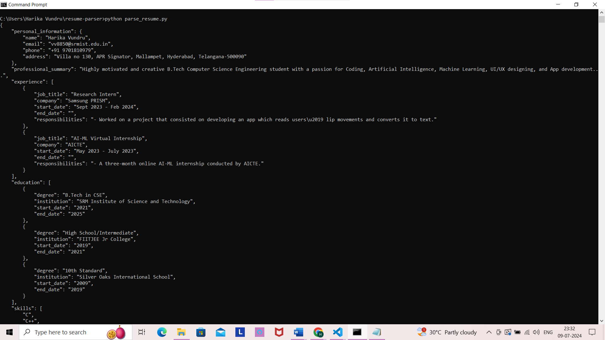
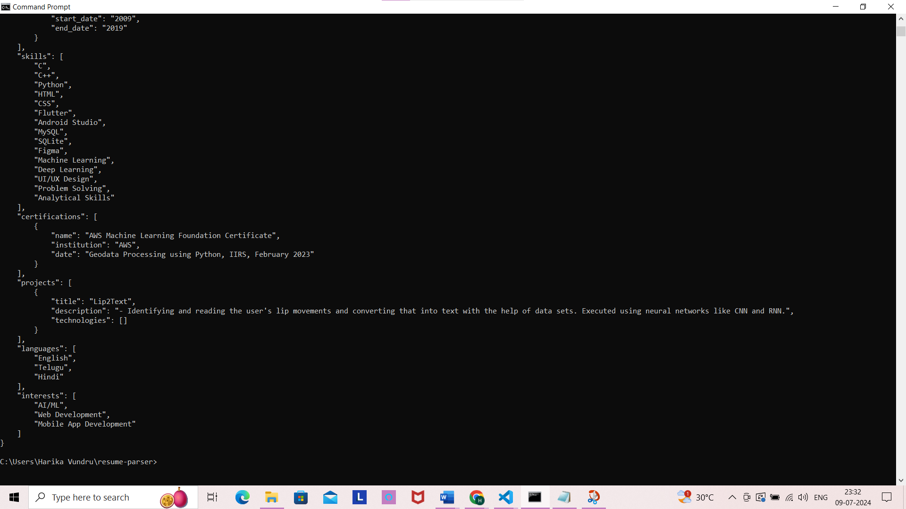

# resume-parser
Short Assignment: Write a ChatGPT Prompt which takes your Resume as input and parse the content in JSON format. Share Github Link of the solution if possible.

Following is my answer to the short assignment provided by Pibit.ai

This basically consists of chatgpt_prompt.txt which contains the prompt to be provided to ChatGPT along with providing your resume as input. For reference I have provided my resume for sample input to ChatGPT. Here from the prompt provided, ChatGPT will provide me the output in JSON format based on extracting information from my resume.

The output of this prompt is present in prompt_output.txt which contains the extracted text one can further use for parsing the resume to finally attain the content in JSON format. This is done with the help of the parse_resume.py python file.

Now the parse_resume.py code consists of python code which uses the extracted information ChatGPT got from the resume provided as an input to further present the text in a JSON format. This is our final output required by the user.

Sample output:

Done by:
Harika Vundru
